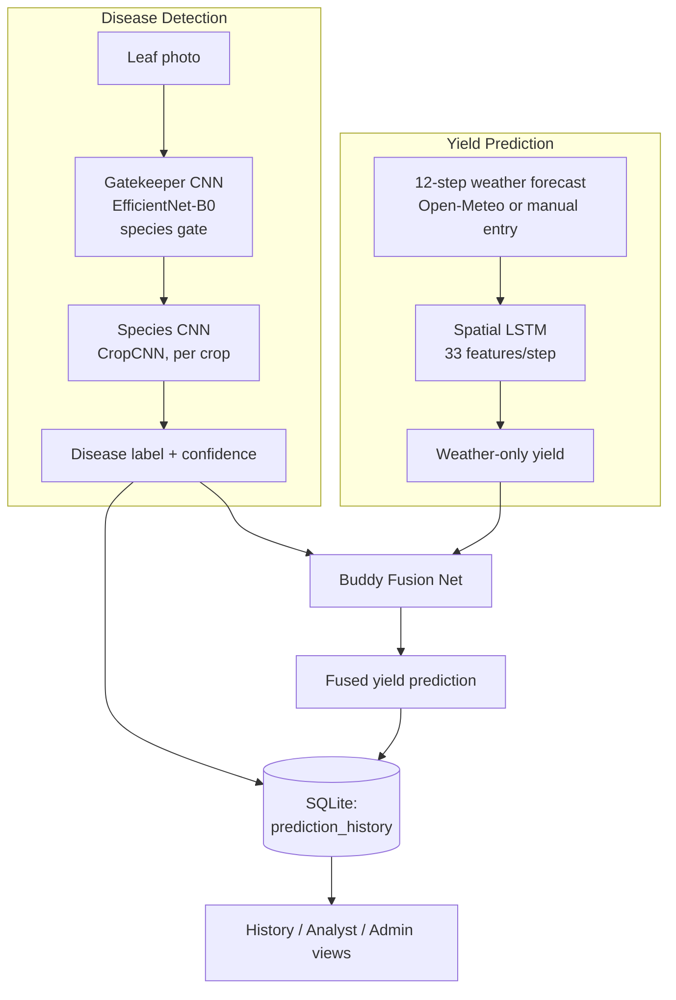

# Field Companion — Smart Multi-Crop Disease Detection & Yield Prediction

An AI-based agricultural decision-support web app for farmers in Nepal. It combines:

1. **Disease Detection** — a two-stage CNN pipeline reads a leaf photo and classifies disease.
2. **Yield Prediction** — a Spatial LSTM reads a 12-step weather forecast and predicts crop yield.
3. **Buddy Fusion** — a small fusion network joins the disease-detection result with the weather-only
   yield forecast, so a sick plant lowers the predicted harvest and a healthy one supports it.

Farmers get one combined result instead of two disconnected numbers. Analysts and admins get
history, analytics, and dataset/model management on top of the same system.

> **Status note:** this README reflects what is actually implemented in the codebase today,
> replacing the earlier `PROJECT_SUMMARY.md` / `DEPLOYMENT_READY.txt` / `IMPLEMENTATION_STATUS.md`
> files, which have been retired in favor of this single document.

---

## Architecture



- **Gatekeeper CNN** (EfficientNet-B0, `timm`): identifies the crop species from the photo.
- **Species CNN** (`CropCNN`, custom 3-layer conv net): classifies the specific disease within
  that species (10–14 classes per crop; 13 species use `CropCNN`, `gatekeeper` uses the
  EfficientNet path directly).
- **Spatial LSTM** (`SpatialPaddyLSTM`): consumes a 12-step weather sequence enriched with
  location, crop, and (if available) plant-health signals — 33 features per step — and predicts
  a weather-only yield.
- **Buddy Fusion Net** (`BuddyFusionNet`): a small MLP that takes the LSTM's yield estimate plus
  plant-health signals from the disease model and produces the final fused yield shown to the
  farmer, along with a plain-language relationship label (e.g. "disease reduces yield").

This is different from the original SRS/DFD diagrams from the lab documents, which described a
single CNN and a plain weather LSTM with no fusion step — see `PROJECT_CONTEXT.md` for that
original spec, now superseded by the above.

---

## Features

- **Disease detection** — CNN-based classification from leaf photos, 14 crops.
- **Yield prediction** — Spatial LSTM + Buddy Fusion, using live or manually entered weather.
- **Web dashboard** — responsive, mobile-friendly single-page interface.
- **REST API** — JSON endpoints for programmatic access.
- **Authentication** — farmer registration/login/logout with session-based auth.
- **Roles** — farmer, analyst, admin, each with scoped views.
- **Prediction history** — SQLite-backed disease and yield records per user.
- **Analyst view** — read access to all prediction history.
- **Admin tools** — user role management, dataset upload (staged, not auto-activated),
  model upload (staged, not auto-activated), and summary analytics.
- **Live weather** — pulls a 12-step forecast from Open-Meteo for supported Nepali agricultural
  regions (Kathmandu Valley, Chitwan, Jhapa, Morang, Rupandehi, Banke, Dang, Kailali, Bara,
  Kaski, and more — see `config.py` for the full list).

## Current Status

| Component | Status |
|---|---|
| Disease detection (Gatekeeper + species CNNs) | Working — 14 crop checkpoints load and run inference |
| Spatial LSTM (weather-only yield) | Working — checkpoint present, trained on synthetic data |
| Buddy Fusion (disease + weather) | Working — checkpoint present, trained on synthetic data |
| Auth, roles, history, admin | Working |
| CSRF protection | Enforced on all non-GET requests (see Security section) |
| Real historical yield data | **Not yet supplied** — bundled `data/yield_data.csv` is synthetic |
| Automated tests | Partial — see `tests/` and `test_app.py`; DB/security/route layers not yet covered |

---

## Project Structure

```
project/
├── app.py                          # Flask application, routes, auth
├── config.py                       # Crop names, disease classes, model paths, weather config
├── create_admin.py                 # CLI to create an admin account
├── generate_synthetic_yield_data.py# Synthetic weather/yield dataset generator
├── train_lstm.py                   # (Legacy) plain weather LSTM training script
├── train_buddy.py                  # Buddy fusion network training script
├── requirements.txt
├── start.sh
├── test_app.py                     # Smoke-test script (live server)
├── models/
│   ├── cnn_arch.py                 # CropCNN, GatekeeperCNN
│   ├── lstm_model.py               # YieldLSTM, SpatialPaddyLSTM, BuddyFusionNet
│   ├── cnn_models/*.pth            # 14 trained disease-detection checkpoints
│   ├── spatial_paddy_lstm_final.pth# Trained Spatial LSTM checkpoint
│   └── buddy_fusion.pth            # Trained Buddy Fusion checkpoint
├── utils/
│   ├── database.py                 # SQLite users + prediction_history
│   ├── security.py                 # CSRF, rate limiting, image validation
│   ├── feature_extractor.py        # Disease-detection inference
│   ├── spatial_features.py         # Feature engineering for the Spatial LSTM / Buddy net
│   ├── yield_pipeline.py           # Orchestrates LSTM + Buddy inference
│   └── data_loader.py              # Legacy YieldDataset for train_lstm.py
├── static/{css,js}/                # Frontend assets
├── templates/                      # Jinja2 templates (dashboard, auth, admin, history)
└── tests/                          # pytest unit tests (spatial features, lazy loading)
```

---

## Installation

### Linux / macOS

```bash
git clone <repo-url>
cd minor-project-bct
python3 -m venv .venv
source .venv/bin/activate
pip install -r requirements.txt
python app.py
```

### Windows (PowerShell)

```powershell
git clone <repo-url>
cd minor-project-bct
python -m venv .venv
.\.venv\Scripts\Activate.ps1
python -m pip install -r requirements.txt
python app.py
```

Open `http://localhost:5000` in a browser.

### Create an admin account

```bash
python create_admin.py
```

### Run the smoke test (while the app is running)

```bash
python test_app.py
```

### Run the unit tests

```bash
pip install pytest
pytest tests/
```

---

## Workflows

- **Farmer**: Sign in → scan a leaf → (optionally) load live weather for a region → predict
  yield → view the combined result → check **History** for past predictions.
- **Analyst**: An admin promotes a farmer's role to `analyst`; the analyst can open **Analyst**
  to review all prediction history.
- **Admin**: Sign in → **Admin** for user/role management and system counts, **Dataset** to
  stage a new CSV for review, **Models** to stage a new `.pth`/`.pt` checkpoint for review.
  Staged files are **not** activated automatically.

---

## API Reference

### `GET /api/health`
Returns system status, device (CPU/GPU), and supported crops.

### `GET /api/weather?place=<region_key>`
Returns a 12-step weather forecast from Open-Meteo for a supported region (see `config.py` →
`AGRICULTURAL_LOCATIONS` for valid keys).

### `POST /api/detect_disease`
```json
{ "crop": "apple", "image": "<base64_encoded_image>" }
```
**200 OK**
```json
{
  "crop": "apple",
  "predicted_class": 3,
  "predicted_label": "Apple__healthy",
  "confidence": 0.9145,
  "class_labels": ["Apple__Apple_scab", "Apple_Black_rot", "Apple_Cedar_apple_rust", "Apple__healthy", "..."],
  "all_probabilities": [0.02, 0.05, 0.03, 0.91],
  "num_classes": 10
}
```

### `POST /api/predict_yield`
```json
{
  "weather": { "temperature": 27, "rainfall": 185, "humidity": 72, "soil_moisture": 65 },
  "crop": "apple",
  "place": "chitwan",
  "disease": { "crop": "apple", "predicted_class": 3, "predicted_label": "Apple__healthy", "confidence": 0.91, "num_classes": 10 }
}
```
Accepts either a single `weather` object (repeated across all 12 steps) or a full
`weather_sequence` array of 12 objects (as returned by `/api/weather`).

**200 OK**
```json
{
  "lstm_yield": 6.1,
  "fused_yield": 6.4,
  "yield_prediction": 6.4,
  "adjustment": 0.3,
  "relationship": "plant_supports_weather",
  "sequence_length": 12
}
```

### Authentication & History
- `GET/POST /register`, `GET/POST /login`, `GET /logout`
- `GET /history` — farmer's own predictions; analyst/admin see all
- `GET /analyst` — analyst-only history view
- `GET /admin`, `GET/POST /admin/dataset`, `GET/POST /admin/models` — admin only
- `GET /api/analytics` — analyst/admin only, JSON summary

All non-GET requests require a valid CSRF token (see Security below).

---

## Model Details

**Gatekeeper CNN** — EfficientNet-B0 (via `timm`), 14-class species classification, 256-dim
feature output, non-strict checkpoint loading to tolerate classifier-head differences.

**CropCNN** — 3-layer conv net (3→16→32→64 channels) with max pooling, 224×224 input,
256-dim feature output, 10-class disease head, used for 13 of the 14 crops.

**SpatialPaddyLSTM** — 2-layer LSTM, hidden size 128, input size 33 per timestep (weather +
location + crop one-hot + plant-health signals), 12-step sequence, outputs a normalized yield.

**BuddyFusionNet** — small MLP (12 → 32 → 16 → 1) that fuses the LSTM yield estimate with
plant-health signals into the final prediction.

**YieldLSTM** (`models/lstm_model.py`, `train_lstm.py`) — a simpler, earlier weather-only LSTM
kept for reference/training experimentation; the live app path uses `SpatialPaddyLSTM` +
`BuddyFusionNet` instead (see `utils/yield_pipeline.py`).

---

## Training

```bash
# Regenerate the synthetic weather/yield dataset
python generate_synthetic_yield_data.py

# Train the buddy fusion network (requires spatial_paddy_lstm_final.pth to already exist)
python train_buddy.py

# (Legacy) train the plain weather-only LSTM
python train_lstm.py
```

**The bundled dataset is synthetic.** Replace `data/yield_data.csv` with real historical
weather/yield observations before treating any accuracy numbers as production-grade. See
`SECURITY_AUDIT.md` for the full list of things to validate before public deployment.

---

## Security

See `SECURITY_AUDIT.md` for the full audit. In short:
- CSRF tokens are enforced on all non-GET requests via `before_request`.
- Passwords are hashed (Werkzeug); sessions are HttpOnly + SameSite=Lax.
- Uploads are size-limited, filename-sanitized, and staged (not auto-activated).
- Security headers (CSP, X-Frame-Options, nosniff, Referrer-Policy) are set on every response.
- Set a real `SECRET_KEY` environment variable before any non-local deployment.

---

## Troubleshooting

- **Flask dev-server warning** — expected locally; use a production WSGI server (e.g. gunicorn)
  for real deployment.
- **"Yield model not found" (503)** — the Spatial LSTM or Buddy checkpoint is missing; check
  `models/spatial_paddy_lstm_final.pth` and `models/buddy_fusion.pth` exist.
- **NNPACK warning** — harmless; PyTorch falls back to standard kernels on unsupported hardware.
- **CUDA/GPU** — the app automatically falls back to CPU if CUDA isn't available.

---

## Known Limitations

- Yield data is synthetic; real historical observations are needed for production accuracy.
- Admin-uploaded datasets/models are staged for review but not schema/shape-validated before
  activation.
- Guest (unauthenticated) predictions are stored with a null user ID.
- No automated CI yet.

## Project Origin

Course: Software Engineering (Practical) — ENCT 352
University: Tribhuvan University, Institute of Engineering, Purwanchal Campus
Submitted to: Asst. Prof. Binay Lal Shrestha
