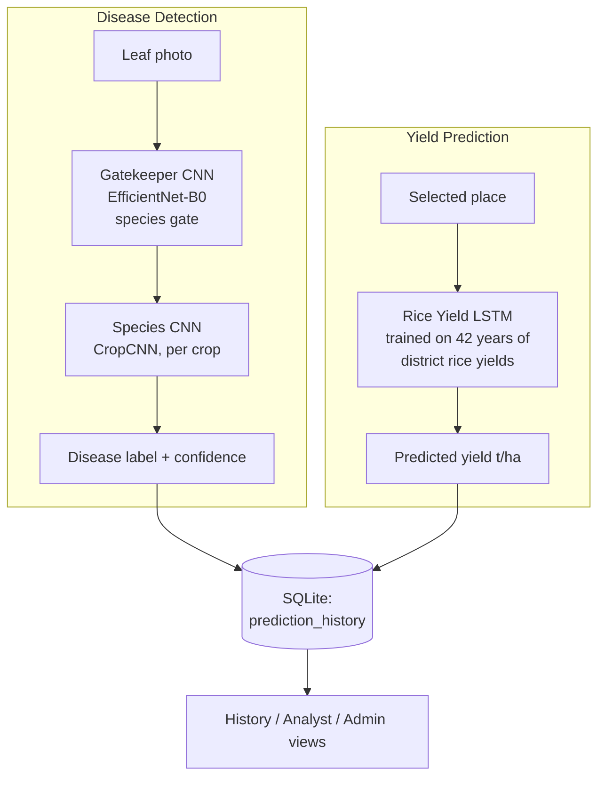

# Field Companion — Smart Multi-Crop Disease Detection & Yield Prediction

An AI-based agricultural decision-support web app for farmers in Nepal. It combines:

1. **Disease Detection** — a two-stage CNN pipeline reads a leaf photo and classifies disease.
2. **Rice Yield Prediction** — an LSTM trained on district-level historical rice yields predicts
   the expected harvest for a selected region. The farmer only picks the place; no weather or
   other inputs are required.

Farmers get both answers from one dashboard. Analysts and admins get history, analytics, and
dataset/model management on top of the same system.

> **Status note:** this README reflects what is actually implemented in the codebase today,
> replacing the earlier `PROJECT_SUMMARY.md` / `DEPLOYMENT_READY.txt` / `IMPLEMENTATION_STATUS.md`
> files, which have been retired in favor of this single document.

---

## Architecture



- **Gatekeeper CNN** (EfficientNet-B0, `timm`): the main model of the disease pipeline. It
  identifies the crop species from the photo, and the image is automatically routed to that
  species' CNN. Farmers can pick **Auto-Detect** in the dashboard to use this two-stage flow,
  or select a crop manually. Its checkpoint was trained on 14 plant species in alphabetical
  order (apple … tomato, including squash, which has no disease CNN) — the mapping lives in
  `GATEKEEPER_CLASS_TO_CROP` in `config.py` and was verified against labeled PlantVillage
  samples (~100% on supported species). If the gatekeeper's top guess is an unsupported
  species (squash), the best supported species is used and flagged via the `fallback` field.
- **Species CNN** (`CropCNN`, custom 3-layer conv net): classifies the specific disease within
  a species (10 classes per crop; one checkpoint per supported crop).
- **Rice Yield LSTM** (`RiceYieldLSTM`): a 2-layer LSTM over each district's historical annual
  rice yields (1979/80–2021/22, Nepal MoALD data via `data/rice_yield_districts.csv`). It sees
  only past yields and predicts the next season's yield for the selected place. Validation MAE
  ≈ 0.23 t/ha. Retrain with `python train_rice_lstm.py`.

This is different from the original SRS/DFD diagrams from the lab documents, which described a
single CNN and a plain weather LSTM with no fusion step — see `PROJECT_CONTEXT.md` for that
original spec, now superseded by the above.

---

## Features

- **Disease detection** — CNN-based classification from leaf photos, 13 crop species plus
  gatekeeper auto-detection.
- **Rice yield prediction** — place-only input; LSTM over historical district rice yields.
- **Web dashboard** — responsive, mobile-friendly single-page interface.
- **REST API** — JSON endpoints for programmatic access.
- **Authentication** — farmer registration/login/logout with session-based auth.
- **Roles** — farmer, analyst, admin, each with scoped views.
- **Prediction history** — SQLite-backed disease and yield records per user.
- **Analyst view** — read access to all prediction history.
- **Admin tools** — user role management, dataset upload (staged, not auto-activated),
  model upload (staged, not auto-activated), and summary analytics.

## Current Status

| Component | Status |
|---|---|
| Disease detection (Gatekeeper + species CNNs) | Working — verified against labeled PlantVillage samples |
| Rice Yield LSTM (place-only input) | Working — trained on real MoALD district data (1979/80–2021/22) |
| Auth, roles, history, admin | Working |
| CSRF protection | Enforced on all non-GET requests (see Security section) |
| Automated tests | Partial — see `tests/` and `test_app.py`; DB/security/route layers not yet covered |

---

## Project Structure

```
project/
├── app.py                          # Flask application, routes, auth
├── config.py                       # Crop names, disease classes, model paths
├── create_admin.py                 # CLI to create an admin account
├── train_rice_lstm.py              # Rice yield LSTM training script
├── requirements.txt
├── test_app.py                     # Smoke-test script (starts its own server)
├── data/
│   └── rice_yield_districts.csv    # District-level paddy yields (MoALD, via open GitHub data)
├── models/
│   ├── cnn_arch.py                 # CropCNN, GatekeeperCNN
│   ├── lstm_model.py               # RiceYieldLSTM
│   ├── cnn_models/*.pth            # Gatekeeper + 13 per-crop disease checkpoints
│   ├── rice_yield_lstm.pth         # Trained rice yield LSTM checkpoint
│   └── rice_yield_meta.json        # Places list + normalization range for the LSTM
├── utils/
│   ├── database.py                 # SQLite users + prediction_history
│   ├── security.py                 # CSRF, rate limiting, image validation
│   ├── feature_extractor.py        # Disease-detection inference + gatekeeper routing
│   └── yield_pipeline.py           # Place → rice yield inference
├── static/{css,js}/                # Frontend assets (incl. self-hosted Chart.js)
├── templates/                      # Jinja2 templates (dashboard, auth, admin, history)
└── tests/                          # pytest unit tests (lazy loading)
```

> **Model checkpoints are not tracked in git** (they are large binaries). After a fresh clone,
> copy the `.pth` files into `models/` from a release asset or your own training run. The disease
> CNNs need `models/cnn_models/*.pth`; the yield model can be rebuilt with
> `python train_rice_lstm.py` using the bundled CSV.

---

## Installation

### Linux / macOS

```bash
git clone <repo-url>
cd minor-project-bct
python3 -m venv .venv
source .venv/bin/activate
pip install -r requirements.txt
python app.py
```

### Windows (PowerShell)

```powershell
git clone <repo-url>
cd minor-project-bct
python -m venv .venv
.\.venv\Scripts\Activate.ps1
python -m pip install -r requirements.txt
python app.py
```

Open `http://localhost:5000` in a browser.

### Create an admin account

```bash
python create_admin.py
```

### Run the smoke test (while the app is running)

```bash
python test_app.py
```

### Run the unit tests

```bash
pip install pytest
pytest tests/
```

---

## Workflows

- **Farmer**: Sign in → scan a leaf → pick a region to predict the rice yield → view results
  → check **History** for past predictions.
- **Analyst**: An admin promotes a farmer's role to `analyst`; the analyst can open **Analyst**
  to review all prediction history.
- **Admin**: Sign in → **Admin** for user/role management and system counts, **Dataset** to
  stage a new CSV for review, **Models** to stage a new `.pth`/`.pt` checkpoint for review.
  Staged files are **not** activated automatically.

---

## API Reference

### `GET /api/health`
Returns system status, device (CPU/GPU), and supported crops.

### `POST /api/detect_disease`
```json
{ "crop": "apple", "image": "<base64_encoded_image>" }
```
Pass `"crop": "auto"` (or `"gatekeeper"`) to run the two-stage gatekeeper pipeline: the
gatekeeper CNN identifies the species, then that species' disease CNN runs automatically.

**200 OK**
```json
{
  "crop": "apple",
  "predicted_class": 3,
  "predicted_label": "Apple__healthy",
  "confidence": 0.9145,
  "class_labels": ["Apple__Apple_scab", "Apple_Black_rot", "Apple_Cedar_apple_rust", "Apple__healthy", "..."],
  "all_probabilities": [0.02, 0.05, 0.03, 0.91],
  "num_classes": 10,
  "gatekeeper": { "predicted_crop": "apple", "confidence": 0.87, "probabilities": {"...": 0.0} }
}
```
The `gatekeeper` object is present only when `crop` was `auto`/`gatekeeper`.

### `POST /api/predict_yield`
```json
{ "place": "jhapa" }
```
Place must be one of the rice-growing districts the model was trained on (see
`models/rice_yield_meta.json`). No other inputs are used.

**200 OK**
```json
{
  "crop": "rice",
  "place": "jhapa",
  "yield_prediction": 2.85,
  "unit": "t/ha",
  "based_on_years": 10,
  "last_record_year": "2021/22"
}
```

### Authentication & History
- `GET/POST /register`, `GET/POST /login`, `GET /logout`
- `GET /history` — farmer's own predictions; analyst/admin see all
- `GET /analyst` — analyst-only history view
- `GET /admin`, `GET/POST /admin/dataset`, `GET/POST /admin/models` — admin only
- `GET /api/analytics` — analyst/admin only, JSON summary

All non-GET requests require a valid CSRF token (see Security below).

---

## Model Details

**Gatekeeper CNN** — EfficientNet-B0 (via `timm`), 14-class species classification, 256-dim
feature output, non-strict checkpoint loading to tolerate classifier-head differences.

**CropCNN** — 3-layer conv net (3→16→32→64 channels) with max pooling, 224×224 input,
256-dim feature output, 10-class disease head, one checkpoint per supported crop.

**SpatialPaddyLSTM** — 2-layer LSTM, hidden size 128, input size 33 per timestep (weather +
location + crop one-hot + plant-health signals), 12-step sequence, outputs a normalized yield.

**BuddyFusionNet** — small MLP (12 → 32 → 16 → 1) that fuses the LSTM yield estimate with
plant-health signals into the final prediction.

---

## Training

```bash
# Regenerate the synthetic weather/yield dataset
python generate_synthetic_yield_data.py

# Train the buddy fusion network (requires spatial_paddy_lstm_final.pth to already exist)
python train_buddy.py
```

**The bundled dataset is synthetic.** Replace `data/yield_data.csv` with real historical
weather/yield observations before treating any accuracy numbers as production-grade. See
`SECURITY_AUDIT.md` for the full list of things to validate before public deployment.

---

## Security

See `SECURITY_AUDIT.md` for the full audit. In short:
- CSRF tokens are enforced on all non-GET requests via `before_request`.
- Passwords are hashed (Werkzeug); sessions are HttpOnly + SameSite=Lax.
- Uploads are size-limited, filename-sanitized, and staged (not auto-activated).
- Security headers (CSP, X-Frame-Options, nosniff, Referrer-Policy) are set on every response.
- Set a real `SECRET_KEY` environment variable before any non-local deployment.

---

## Troubleshooting

- **Flask dev-server warning** — expected locally; use a production WSGI server (e.g. gunicorn)
  for real deployment.
- **"Yield model not found" (503)** — the Spatial LSTM or Buddy checkpoint is missing; check
  `models/spatial_paddy_lstm_final.pth` and `models/buddy_fusion.pth` exist.
- **NNPACK warning** — harmless; PyTorch falls back to standard kernels on unsupported hardware.
- **CUDA/GPU** — the app automatically falls back to CPU if CUDA isn't available.

---

## Known Limitations

- Yield data is synthetic; real historical observations are needed for production accuracy.
- Admin-uploaded datasets/models are staged for review but not schema/shape-validated before
  activation.
- Guest (unauthenticated) predictions are stored with a null user ID.
- No automated CI yet.

## Project Origin

Course: Software Engineering (Practical) — ENCT 352
University: Tribhuvan University, Institute of Engineering, Purwanchal Campus
Submitted to: Asst. Prof. Binay Lal Shrestha
